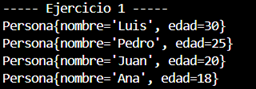
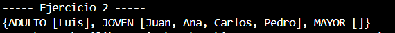
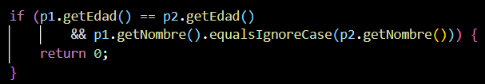

# Universidad Politécnica Salesiana

- Carrera: Computación
- Asignatura: Estructuras de Datos

Integrantes:
- Emilio Montaleza — emontalezae@ups.edu.ec
- Sebastian Alvarez — malvarezr9@ups.edu.ec
- Sebastian Muñoz — smunozg3@ups.edu.ec

Grupo: 1
Fecha: 28 de julio de 2026

Proyecto: Visualizador de rutas sobre un mapa mediante grafos (BFS / DFS)

---

### Índice

1. Objetivo
2. Descripción del problema
3. Marco teórico sobre grafos, BFS y DFS
4. Tecnologías utilizadas
5. Diagrama UML y explicación
6. Arquitectura y estructura de carpetas
7. Explicación general del funcionamiento
8. Capturas de configuraciones de mapas
9. Ejemplo comentado de un algoritmo (BFS)
10. Tabla comparativa de resultados
11. Conclusión individual por integrante
12. Recomendaciones y posibles aplicaciones futuras

---

### 1. Objetivo

El objetivo de este trabajo fue construir una aplicación en Java que represente un mapa como un grafo, donde el usuario pueda crear puntos y conexiones sobre una imagen, y luego buscar una ruta entre dos de esos puntos usando los algoritmos BFS y DFS, viendo en pantalla tanto el proceso de búsqueda como el camino final.

Para lograrlo se planteó lo siguiente:

- Crear una estructura de grafo que soporte conexiones en un solo sentido y en ambos sentidos.
- Implementar BFS y DFS de manera que se puedan usar indistintamente sin cambiar el resto del código.
- Hacer una interfaz gráfica donde el usuario arme el mapa haciendo clic sobre la imagen.
- Guardar y volver a cargar la configuración del mapa desde un archivo, para no perder el trabajo cada vez que se cierra el programa.
- Mostrar de forma diferente el recorrido que hace el algoritmo mientras busca, y el camino final que encontró.

---

### 2. Descripción del problema

Encontrar una ruta entre dos puntos es algo común en la vida diaria: cómo llegar de un lugar a otro dentro de una ciudad, cómo organizar una entrega, o cómo moverse dentro de una red de caminos. Este tipo de problema se puede representar con un grafo, donde cada punto del mapa es un nodo y cada calle o conexión entre dos puntos es una arista.

Con esa idea en mente, el proyecto busca que el usuario pueda:

- Construir su propio mapa agregando nodos y conexiones, incluyendo calles de un solo sentido y de doble sentido.
- Buscar la ruta entre un punto de inicio y uno de destino, y comparar cómo se comportan BFS y DFS sobre el mismo mapa.
- Guardar esa configuración para no tener que rehacer el mapa cada vez que se abre el programa.

Para eso se hizo una aplicación de escritorio con Java Swing, donde uno interactúa directamente sobre la imagen del mapa: hace clic para crear nodos, los conecta haciendo clic sobre dos de ellos, elige el algoritmo y el modo en que quiere ver el resultado, y el programa se encarga de calcular y dibujar la ruta.

---

### 3. Marco teórico sobre grafos, BFS y DFS

**Grafos**

Un grafo es una estructura formada por un conjunto de nodos y un conjunto de conexiones entre esos nodos. Puede ser dirigido, cuando la conexión va en un solo sentido, o no dirigido, cuando funciona en ambos sentidos. En este proyecto se usan los dos tipos al mismo tiempo, ya que hay calles de doble vía y calles de un solo sentido.

También puede ser ponderado, si cada conexión tiene un costo asociado (como distancia o tiempo), o no ponderado, si todas las conexiones valen lo mismo. Acá el grafo es no ponderado.

Internamente, el grafo se guarda como una lista de adyacencia: cada nodo tiene asociado un conjunto con los nodos a los que está conectado directamente.

**BFS (búsqueda en anchura)**

BFS recorre el grafo por niveles: primero revisa todos los vecinos directos del nodo de inicio, después los vecinos de esos vecinos, y así hasta llegar al destino. Para lograr esto usa una cola, que respeta el orden en que los nodos fueron descubiertos.

Mientras recorre, va guardando quién descubrió a quién, y con eso puede reconstruir el camino una vez que llega al nodo destino. Gracias a esta forma de explorar, BFS siempre encuentra el camino más corto en número de saltos, cuando el grafo no tiene pesos.

**DFS (búsqueda en profundidad)**

DFS funciona distinto: avanza lo más que puede por una rama antes de retroceder. En este proyecto se hizo de forma recursiva, así que desde un nodo se visita un vecino sin explorar, y desde ese vecino se repite el proceso, hasta llegar al destino o hasta quedarse sin opciones, momento en el que retrocede y prueba otro camino.

DFS no garantiza encontrar la ruta más corta, pero sí garantiza encontrar alguna ruta si es que existe. Es útil cuando lo que importa es saber si hay conexión entre dos puntos, o cuando se quiere recorrer todo el grafo.

Los dos algoritmos comparten la misma forma de entregar resultados (una lista con los nodos visitados y otra con el camino final), lo que permite compararlos fácilmente ejecutando la misma búsqueda con ambos sobre el mismo mapa.

---

### 4. Tecnologías utilizadas

- Java como lenguaje de programación.
- Java Swing para la parte gráfica (ventana, botones, listas desplegables, cuadros de diálogo).
- Colecciones de Java, como mapas, conjuntos y colas, para armar el grafo y los algoritmos de búsqueda.
- Programación orientada a objetos, usando interfaces para separar los algoritmos, la persistencia y la vista.
- Un archivo de texto en formato CSV para guardar y cargar la configuración del mapa.
- Genéricos en Java, que permiten usar la misma estructura de grafo tanto para pruebas simples como para los puntos del mapa.
- Git y GitHub para llevar el control de versiones del proyecto.

---

### 5. Diagrama UML y explicación

El proyecto se organiza principalmente en las siguientes clases:

- **Graph**: es el grafo en sí. Guarda los nodos y sus conexiones, y permite agregarlos, quitarlos y consultar los vecinos de un nodo.
- **Node**: representa un nodo dentro del grafo, guardando el valor que contiene.
- **PathFinder**: es una interfaz que define cómo se debe buscar un camino entre dos nodos. La implementan dos clases: BFSPathFinder, que busca con BFS, y DFSPathFinder, que busca con DFS.
- **PathResult**: guarda el resultado de una búsqueda, con la lista de nodos visitados y la lista del camino final.
- **MapPoint**: representa un punto del mapa, con un identificador y una posición en pantalla (x, y). Es el tipo de dato que usa el grafo dentro de la aplicación del mapa.
- **GraphRepository**: es una interfaz para guardar y cargar el grafo. La implementa FileGraphRepository, que trabaja con el archivo mapa.csv.
- **MapController**: coordina todo. Usa el grafo, la persistencia y la vista para agregar nodos, crear conexiones, guardar o cargar el mapa, y ejecutar las búsquedas.
- **MapView**: es una interfaz que define cómo se debe mostrar la información en pantalla. La implementa MainFrame, la ventana principal del programa.

La idea detrás de esto es que el controlador no depende directamente de BFS o de DFS, sino de la interfaz PathFinder, y tampoco depende directamente de la ventana, sino de la interfaz MapView. Así, se puede cambiar el algoritmo o la forma de guardar los datos sin tocar el resto del programa.

---

### 6. Arquitectura y estructura de carpetas

El proyecto está dividido en carpetas según la responsabilidad de cada parte, dentro de la carpeta src:

- App.java: es el archivo donde arranca el programa.
- controllers: contiene MapController, que conecta el grafo, la persistencia y la vista.
- models: contiene MapPoint y VisualizationMode (el modo de visualización, exploración o camino final).
- persistence: contiene GraphRepository y FileGraphRepository, encargados de guardar y cargar el mapa.
- structures: contiene las estructuras de datos usadas en el proyecto.
  - node: la clase Node.
  - grafos: la clase Graph, la interfaz PathFinder, la clase PathResult y, dentro de implementations, BFSPathFinder y DFSPathFinder.
  - trees: árboles binarios de una práctica anterior de la unidad.
- views: contiene MapView, MainFrame, MapPanel y MapClickListener, todo lo relacionado con la parte gráfica.
- resources: contiene la imagen que se usa como fondo del mapa.
- imagenes: contiene las capturas usadas en este informe.

Afuera de src está el archivo mapa.csv, que guarda la configuración del mapa entre una ejecución y otra.

Separar el proyecto así ayuda a que cada parte tenga una tarea clara: los modelos solo guardan datos, las estructuras tienen la lógica de los algoritmos, la persistencia se encarga de los archivos, el controlador conecta todo y las vistas solo muestran información.

---

### 7. Explicación general del funcionamiento

Cuando se abre el programa, se crea la persistencia, el controlador y la ventana principal. El controlador intenta cargar automáticamente lo que haya guardado en mapa.csv de una sesión anterior.

Luego, el usuario interactúa con el mapa haciendo clic:

- Si hace clic en un espacio vacío, se le pide un nombre para el nodo y se crea ahí mismo.
- Si hace clic sobre un nodo ya existente, ese nodo queda seleccionado, esperando un segundo clic.
- Si el segundo clic cae sobre otro nodo, se le pregunta si la conexión entre ambos es de doble vía o de un solo sentido, y se crea la conexión.

En cualquier momento se puede guardar o cargar la configuración completa del mapa usando los botones correspondientes, que escriben o leen el archivo mapa.csv.

Para buscar una ruta, se elige un nodo de inicio, uno de destino, el algoritmo (BFS o DFS) y el modo en que se quiere ver el resultado, y se presiona el botón de buscar. El programa ejecuta el algoritmo elegido sobre el grafo actual y muestra el resultado sobre el mapa: en modo exploración se ve el orden en que fue recorriendo los nodos, y en modo camino final solo se marca la ruta encontrada.

También hay un botón para limpiar lo que se dibujó, sin borrar los nodos ni las conexiones que ya existen.

---

### 8. Capturas de configuraciones de mapas

A continuación se muestran distintas configuraciones y resultados obtenidos sobre el mapa, con diferentes nodos, conexiones y algoritmos de búsqueda.

Configuración / resultado 1:



Configuración / resultado 2:



Comparación entre ambos resultados:



Nota: se puede complementar esto con capturas propias, por ejemplo el mismo mapa resuelto una vez con BFS y otra con DFS, indicando qué nodos de inicio y destino se usaron en cada caso.

---

### 9. Ejemplo comentado de un algoritmo (BFS)

Este es el funcionamiento del algoritmo BFS, que se encarga de encontrar el camino más corto entre dos nodos del grafo:

```
public PathResult<T> find(Graph<T> graph, T start, T end) {

    List<T> visited = new ArrayList<>();       // Orden en que se visitan los nodos
    List<T> path = new ArrayList<>();          // Camino final, de inicio a destino

    Set<T> visitedSet = new LinkedHashSet<>(); // Para no procesar un nodo dos veces
    Map<T, T> predecesores = new LinkedHashMap<>(); // Guarda desde qué nodo se descubrió cada nodo
    Queue<T> cola = new ArrayDeque<>();        // La cola es la que hace que se explore por niveles

    cola.add(start);
    visitedSet.add(start);

    boolean encontrado = false;

    while (!cola.isEmpty()) {
        T actual = cola.poll();     // Se toma el nodo más antiguo en la cola
        visited.add(actual);

        if (actual.equals(end)) {   // Si es el destino, termina la búsqueda
            encontrado = true;
            break;
        }

        for (Node<T> vecino : graph.getVecinos(actual)) {
            T valorVecino = vecino.getValue();

            if (!visitedSet.contains(valorVecino)) {
                visitedSet.add(valorVecino);
                predecesores.put(valorVecino, actual); // Se recuerda quién lo descubrió
                cola.add(valorVecino);
            }
        }
    }

    if (encontrado) {
        T paso = end;
        while (paso != null) {
            path.add(0, paso);           // Se arma el camino desde el final hacia el inicio
            paso = predecesores.get(paso);
        }
    }

    return new PathResult<>(visited, path);
}
```

Al usar una cola, todos los nodos que están a un salto del inicio se procesan antes que los que están a dos saltos, y así sucesivamente. Por eso, la primera vez que se llega al nodo destino, el camino que se arma a partir de los predecesores es el más corto posible en número de conexiones.

---

### 10. Tabla comparativa de resultados

**Tabla 1. Comparación de BFS y DFS**

| Caso | Algoritmo | Inicio | Destino | Nodos visitados | Cantidad de aristas | Tiempo |
|---|---|---|---|---|---|---|
| 1 | BFS | A | K | 9 | 4 | 0.0479 ms |
| 1 | DFS | A | K | 9 | 4 | 0.0342 ms |
| 2 | BFS | C | H | 9 | 4 | 0.0707 ms |
| 2 | DFS | C | H | 5 | 4 | 0.0243 ms |
| 3 | BFS | I | B | 6 | 4 | 0.0428 ms |
| 3 | DFS | I | B | 5 | 4 | 0.0151 ms |

Esta tabla se completa ejecutando el programa: se eligen tres pares de nodos distintos (inicio y destino) y cada par se prueba una vez con BFS y otra con DFS, anotando cuántos nodos visitó cada algoritmo, cuántas aristas tiene el camino final encontrado, y el tiempo que tomó la búsqueda.

**Análisis requerido**

Después de completar las pruebas, se debe responder lo siguiente:

¿Qué diferencias se observaron en el orden de exploración de BFS y DFS?
BFS recorre el grafo por niveles, revisando primero todos los vecinos directos del nodo de inicio antes de avanzar más lejos. DFS, en cambio, avanza por una sola rama hasta el final antes de retroceder y probar otra. Esto hace que, aunque ambos partan del mismo nodo, el orden en que van marcando los nodos como visitados sea distinto casi siempre.

¿BFS encontró una ruta con menor cantidad de aristas en todos los casos evaluados?
En un grafo sin pesos, como el de este proyecto, BFS está diseñado para encontrar siempre el camino con menos saltos entre el inicio y el destino. Lo esperable es que en los tres casos la ruta de BFS tenga la misma o menor cantidad de aristas que la de DFS. Esto se debe confirmar con los datos reales de la Tabla 1.

¿DFS encontró rutas diferentes a las obtenidas con BFS?
Por lo general sí, salvo que entre los dos nodos exista un único camino posible. Como DFS no busca el camino más corto sino que sigue una rama hasta el final, es común que el camino que entrega sea más largo o distinto al de BFS.

¿Qué algoritmo visitó más nodos en cada caso?
Esto depende de cómo estén distribuidos los nodos y las conexiones en el mapa. BFS suele visitar más nodos cuando el destino está rodeado de varios caminos cortos, porque revisa muchos vecinos antes de avanzar. DFS puede visitar menos nodos si toma la rama correcta desde el inicio, o más si primero explora ramas que no llevan a ningún lado. La respuesta concreta depende de los valores registrados en la Tabla 1.

¿Los tiempos de ejecución fueron suficientes para determinar cuál algoritmo es mejor?
En mapas pequeños como los usados en las pruebas, ambos algoritmos se ejecutan en tiempos muy cortos y muy parecidos entre sí, por lo que el tiempo de ejecución por sí solo no es un buen indicador para decidir cuál algoritmo es mejor. Es más representativo comparar la cantidad de nodos visitados y la longitud del camino encontrado.

¿Cómo influyó la estructura del grafo en el comportamiento de cada algoritmo?
La cantidad de conexiones por nodo, el uso de conexiones de un solo sentido y el orden en que se agregaron los vecinos afectan directamente el recorrido. Entre más conexiones tenga un nodo, más opciones debe evaluar cada algoritmo, y las calles de un solo sentido pueden bloquear caminos que en apariencia se ven más cortos, obligando a ambos algoritmos a buscar rutas alternativas.

¿Qué ventajas aporta separar la lógica del algoritmo de la visualización?
Al tener BFS y DFS trabajando solo con el grafo y devolviendo un resultado (PathResult), sin depender de la ventana ni de los componentes gráficos, es posible probar y corregir los algoritmos sin necesidad de abrir la interfaz. También permite agregar un nuevo algoritmo de búsqueda en el futuro sin tener que modificar la parte visual del programa.

¿Qué mejoras podrían implementarse para trabajar con calles ponderadas?
Se necesitaría agregar un valor de peso o costo a cada conexión (por ejemplo, la distancia entre dos puntos), guardar ese dato también en el archivo mapa.csv, y cambiar la forma en que se explora el grafo para que, en lugar de contar solo los saltos, se sume el costo acumulado del camino. Con esos cambios se podría implementar un algoritmo como Dijkstra en lugar de, o además de, BFS y DFS.

Nota: este análisis debe completarse y ajustarse con base en la implementación, los resultados obtenidos en la Tabla 1 y las capturas generadas por el grupo.

---

### 11. Conclusión individual por integrante

Cada integrante redacta su propia conclusión, relacionando el funcionamiento de BFS y DFS con los resultados obtenidos en la Tabla 1.

**Emilio Montaleza:**
Esta práctica permitió entender de forma aplicada el funcionamiento de los grafos y la diferencia real entre BFS y DFS: mientras BFS explora por niveles con una cola y garantiza el camino más corto, DFS avanza en profundidad usando recursión y no siempre da la ruta más directa. La mayor dificultad fue coordinar la interfaz gráfica con la lógica del grafo, especialmente al manejar los clics para crear nodos y conexiones. En general, reforzó la importancia de separar el proyecto en capas para facilitar las pruebas y el mantenimiento.

**[Nombre integrante 2]:**
El proyecto ayudó a reforzar los conocimientos sobre grafos y su aplicación en un problema real como la búsqueda de rutas. Comparar BFS y DFS sobre el mismo mapa permitió ver claramente cómo cada uno recorre el grafo de forma distinta y cuándo conviene usar uno u otro. Trabajar con la persistencia en el archivo mapa.csv también dejó clara la importancia de guardar y recuperar bien el estado de una estructura de datos entre ejecuciones.

**[Nombre integrante 3]:**
Esta práctica permitió pasar de la teoría de grafos a una implementación funcional y visual, lo que facilitó entender conceptos como nodos, aristas y caminos. Fue interesante notar que, aunque BFS y DFS tienen la misma complejidad en tiempo, su comportamiento práctico es muy distinto según el problema. El mayor reto fue manejar correctamente los casos donde no existe un camino entre dos nodos o la configuración está incompleta, lo que resaltó la importancia de validar bien los datos.

---

### 12. Recomendaciones y posibles aplicaciones futuras

Recomendaciones:

- Validar la configuración antes de construir el grafo.
- Evitar que los algoritmos modifiquen directamente los componentes de la interfaz.
- Utilizar identificadores únicos para todos los nodos.
- Controlar correctamente los nodos visitados para evitar ciclos infinitos.
- Agregar pesos a las conexiones (como distancia o tiempo) para poder usar algoritmos como Dijkstra, que sí consideran el costo real de cada tramo.
- Mostrar en pantalla algunas métricas de la búsqueda, como cantidad de nodos visitados o tiempo que tomó encontrar la ruta.
- Validar mejor los datos que se leen del archivo mapa.csv, por ejemplo cuando las coordenadas quedan fuera del rango de la imagen.

Y algunas posibles aplicaciones a futuro:

- Adaptar el sistema para trabajar con mapas reales, usando coordenadas geográficas y alguna API de mapas.
- Usarlo como base para un sistema de rutas de entrega o de logística.
- Reutilizar la misma estructura de grafo para modelar otro tipo de redes, como redes sociales o redes de computadoras.
- Agregar un modo donde se ejecuten BFS y DFS al mismo tiempo sobre el mismo mapa, para comparar los resultados uno junto al otro.

---

### Control de versiones

Este proyecto se aloja en un repositorio público de GitHub, usado para llevar el control de versiones del código, los recursos del proyecto (imágenes, mapa.csv) y este mismo informe (README.md).
